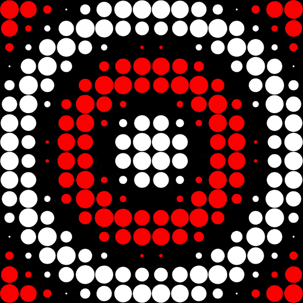

# tixies

*A coding playground in which you can control a matrix of dots with a single JavaScript function. 
\- Inspired by Martin Kleppe's code golf tool [tixy](https://github.com/aemkei/tixy).*

⚡ [Give it a spin](https://michaelbrunn3r.github.io/tixies/) ⚡

This project was created to learn about building 'complex' and interactive websites using svelte.

Non-exhaustive list of features:
- Live coding: The animation is updated while you change the transform function
- Interactive layout
- **WebGL instancing**: The dots are rendered on a canvas using WebGL instancing. This allows for a huge amount of dots at once

